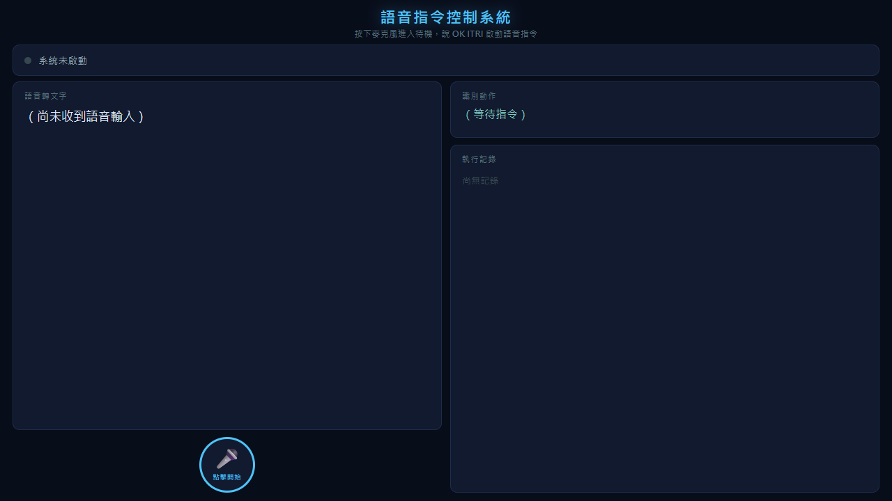

# 語音指令控制系統

透過網頁麥克風收音，說出喚醒詞 **OK ITRI** 後輸入英文指令，系統以 TTS 朗讀動作並等待確認，根據語意決定執行或重試。執行完畢或取消後自動回到待機狀態。



## 需求

- Google Chrome 或 Microsoft Edge（Firefox 不支援 Web Speech API）
- 麥克風裝置
- Node.js（用於本地伺服器）
- 網路連線（Web Speech API 需使用雲端 STT 服務）

## 啟動方式

> **注意：** 請勿直接雙擊 `index.html`。瀏覽器對 `file://` 不會記憶麥克風授權，每次都會重新詢問。請改用本地伺服器。

**方法一：雙擊批次檔**

雙擊 `啟動伺服器.bat`，瀏覽器會自動開啟 `http://localhost:3000`。

**方法二：終端機**

```bash
cd voice-command-system
node server.js
```

伺服器啟動後，在 Chrome / Edge 允許麥克風一次即會記住授權。按 `Ctrl+C` 停止伺服器。

## 介面說明

頁面分為左右兩欄，不需卷軸：

```
┌──────────────────────────────────────────┐
│  語音指令控制系統  ●系統狀態             │
├──────────────────────┬───────────────────┤
│  語音轉文字           │  識別動作          │
│  （即時顯示辨識內容） ├───────────────────┤
│                      │  執行記錄          │
├──────────────────────┤  （歷史清單）      │
│      [🎤 麥克風]     │                   │
│  [確認提示]          │                   │
└──────────────────────┴───────────────────┘
```

確認執行時，畫面出現全螢幕「動作執行中」overlay，顯示載具類型（AMR / UAV）、動作名稱、API 路徑與進度條。

## 使用方式

1. 啟動伺服器，瀏覽器開啟 `http://localhost:3000`
2. 首次使用時允許瀏覽器存取麥克風
3. 按下麥克風按鈕（或按**空白鍵**）進入**待機模式**
4. 說出喚醒詞 **"OK ITRI"**，系統偵測到後自動開始聆聽指令
5. 說出英文指令，例如：`"run indoor script number 1"`
6. 系統比對關鍵字後，TTS 朗讀：`"Run Indoor Script Number 1. Please say yes or no."`
7. 系統自動開始聆聽確認回覆：
   - **Yes / Confirm** → 全螢幕顯示載具類型（AMR 或 UAV）＋動作名稱＋ API 路徑＋進度條，完成後回到**待機模式**
   - **No / Cancel** → TTS 朗讀 "Cancelled."，回到**待機模式**
   - **無法辨識** → TTS 詢問 "Please say yes or no."，重新聆聽
8. 再次按下麥克風可隨時**取消待機**，回到完全關閉狀態

## 流程圖

```
按麥克風
    ↓
【待機模式】持續聆聽喚醒詞 OK ITRI
    │ 再次按麥克風 → 取消待機 → 關閉
    ↓ 偵測到 OK ITRI
語音辨識指令（STT, en-US）→ 文字顯示於畫面
    ↓
指令關鍵字比對
    ├─ 無匹配 → TTS "Command not recognized." → 回到待機模式
    └─ 有匹配 → 顯示識別動作
                    ↓
               TTS 朗讀動作 + "Please say yes or no."
                    ↓
               自動開始聆聽確認
                    ├─ Yes  → 全螢幕「動作執行中」+ 載具 + API + 進度條 → 回到待機模式
                    ├─ No   → TTS "Cancelled." → 回到待機模式
                    └─ 不明確 → TTS "Please say yes or no." → 重新聆聽
                    
    （任何階段按麥克風 → 取消動作 → 回到待機模式）
```

## 內建指令

| 語音指令 | 執行動作 | 載具 | API 路徑 |
|---------|----------|------|----------|
| run indoor script number 1 | Run Indoor Script Number 1 | **AMR** | `POST /api/v1/indoor/script/1` |
| run indoor script number 2 | Run Indoor Script Number 2 | **AMR** | `POST /api/v1/indoor/script/2` |
| run outdoor script number 1 | Run Outdoor Script Number 1 | **UAV** | `POST /api/v1/outdoor/script/1` |

> 載具類型（AMR / UAV）在執行 overlay 中以大型發光文字顯示：AMR 為藍色、UAV 為金色。

> 若語音不符合任何關鍵字，系統直接拒絕並回到待機模式，不會進入確認流程。

## 確認語意關鍵字

| 類型 | 關鍵字 |
|------|--------|
| 正面（確認執行） | yes, correct, right, confirm, ok, okay, affirmative, execute, go, do it, proceed, sure |
| 負面（取消重試） | no, wrong, cancel, stop, incorrect, negative, abort, reject, don't, nope |

## 狀態指示燈

| 顏色 | 狀態 |
|------|------|
| 灰色 | 系統關閉（IDLE） |
| 青色（慢閃） | 待機中，等待喚醒詞 OK ITRI |
| 紅色（快閃） | 錄音中 |
| 橘色（快閃） | 分析指令中 |
| 藍色（閃） | TTS 播報中 |
| 紫色（慢閃） | 等待確認回覆 |
| 綠色（快閃） | 執行動作中 |
| 橘紅色（閃） | 指令無法辨識 |

## 擴充指令

在 `index.html` 的 `COMMANDS` 陣列中新增一筆記錄：

```javascript
{
  keywords: ['keyword a', 'keyword b'],
  action: 'Action Description',
  vehicle: 'AMR',          // 'AMR' 或 'UAV'，省略則不顯示載具
  api: 'POST /your/api'    // 省略則執行時不顯示 API 路徑
},
```

## 專案結構

```
voice-command-system/
├── index.html        # 主程式（單一檔案，含 HTML / CSS / JavaScript）
├── server.js         # 本地靜態伺服器（Node.js，port 3000）
├── 啟動伺服器.bat     # 雙擊即可啟動伺服器並開啟瀏覽器
└── README.md
```
